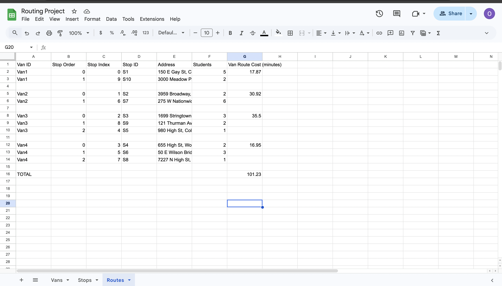

# Van Route Optimizer

## Umeyma Ibrahim  
GitHub: https://github.com/omemai  

---

## Overview

Van Route Optimizer is a backend-driven route optimization system that integrates real-world APIs with algorithmic optimization to solve a practical logistics problem.

The system ingests live delivery data from Google Sheets, constructs a distance matrix using the Google Maps Distance Matrix API, solves a multi-vehicle routing problem, and writes structured results back to the source.

This project demonstrates applied optimization, API-driven backend design, and modular system architecture in a production-style Python environment.

---

## Core Features

- Multi-vehicle route optimization (Vehicle Routing Problem)
- Google Sheets integration for live operational data
- Google Maps Distance Matrix API integration
- Intelligent distance caching to reduce redundant API calls
- Agent-based orchestration and validation layer
- Secure environment-based API key management
- Modular backend architecture designed for scalability

---

## System Workflow

1. Read stop and depot data from Google Sheets  
2. Validate and normalize address inputs  
3. Retrieve distance and duration matrices from Google Maps  
4. Construct and solve a Vehicle Routing Problem (VRP)  
5. Assign optimized stop sequences to each vehicle  
6. Calculate total route distance and duration per van  
7. Write structured route results back to Google Sheets  

---

## Architecture

The project follows a clean separation-of-concerns backend design:

- **main.py** — Entry point and orchestration  
- **sheets.py** — Google Sheets I/O layer  
- **maps.py** — Distance matrix retrieval and caching  
- **optimizer.py** — Core routing and optimization logic  
- **formatter.py** — Structured output formatting  
- **agent.py** — Execution coordination and validation  

The architecture isolates business logic from infrastructure layers, enabling maintainability, extensibility, and future integration of additional optimization constraints.

---

## Example Output

Below is an example of optimized route assignments written back to Google Sheets:

---